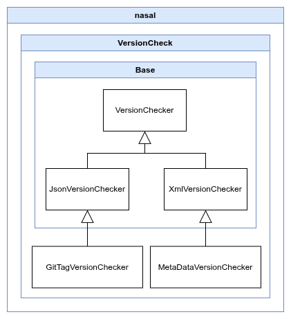
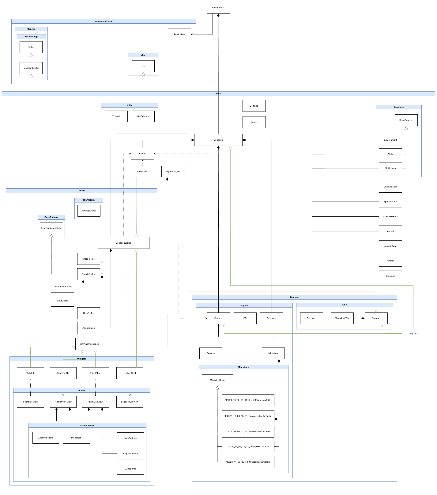

FlightGear Add-on Framework
===========================

This is a Framework project containing a set of classes and mechanisms to help create add-ons for FlightGear.

## Table of Contents

1. [Features in brief](#features-in-brief)
2. [How to install](#how-to-install)
3. [How to use it](#how-to-use-it)
    1. [Application Hooks](#application-hooks)
4. [Reload add-on and `.env` file](#reload-add-on-and-env-file)
5. [Canvas Dialog](#canvas-dialog)
    1. [`PersistentDialog` Class](#persistentdialog-class)
    2. [Minimal example of creating a Transient dialog](#minimal-example-of-creating-a-transient-dialog)
    3. [Minimal example of creating a Persistent dialog](#minimal-example-of-creating-a-persistent-dialog)
    4. [Deferring Canvas loading](#deferring-canvas-loading)
6. [Autoloader of Nasal files](#autoloader-of-nasal-files)
7. [Namespaces](#namespaces)
8. [Version Checker](#version-checker)
    1. [Method 1. MetaDataVersionChecker](#method-1-metadataversionchecker)
    2. [Method 2. GitTagVersionChecker](#method-2-gittagversionchecker)
    3. [Version notation for add-on](#version-notation-for-add-on)
    4. [Version notation for git tags](#version-notation-for-git-tags)
    5. [Class diagram](#class-diagram)
    6. [How to notify the user about a new version?](#how-to-notify-the-user-about-a-new-version)
9. [Framework Config](#framework-config)
10. [Global Variables](#global-variables)
11. [Class Diagram](#class-diagram-of-framework)

## Features in brief

1. Automatic recognition and loading of add-on Nasal files into the appropriate namespaces (with an exclusion list if necessary).
2. Ability to add a menu for restarting add-on Nasal files without having to change repository files.
3. Ability to define keys for the multi-key command to restart add-on Nasal files without having to change repository files.
4. A mechanism for checking whether there is a new version of your add-on to inform users about it.
5. Base classes for Canvas windows that are created and destroyed on demand (Transient dialog), as well as created once during simulator startup (Persistent dialog).
6. Ability to create Nasal unit tests and run them using multi-key command.

## How to install

First, you need to create a skeleton of your add-on, for example, based on [Skeleton](https://sourceforge.net/p/flightgear/fgaddon/HEAD/tree/trunk/Addons/Skeleton/). Then, create a subdirectory, such as `framework`, in the root directory and copy the Framework's contents into it. The simplest file structure should be as follows:

```text
your-addon/
|── framework/    (the entire framework project)
|   |── nasal/    (Nasal framework files that will be used)
|   |── addon-main.nas   (framework main file - not used in your add-on, but serves as a template)
|   |── addon-menubar-items.xml    (this file will not be used)
|   |── addon-metadata.xml         (this file will not be used)
|   └── etc...
|── nasal/    (your additional Nasal files)
|── addon-main.nas    (main file of your add-on - it's the one being used)
|── addon-menubar-items.xml
└── addon-metadata.xml
```

It's recommended using Git and its subtree for this purpose, which will allow you to automatically update the Framework. Assuming your add-on also uses Git, to do this, run:

```bash
git subtree add --prefix=framework git@github.com:PlayeRom/flightgear-addon-framework.git v1.0.0 --squash
```

Change `v1.0.0` to the version you want to download.

This will automatically create a `/framework` subdirectory in your directory with all the files.

Then, to update the Framework, for example, for the version `v.1.0.1`, simply run:

```bash
git subtree pull --prefix=framework git@github.com:PlayeRom/flightgear-addon-framework.git v1.0.1 --squash -m "Update framework"
```

The directory does not have to be called `framework`, you can use any other name, but it cannot be `nasal` and you can't create more nested directories.

Alternatively, you can also download [Canvas Skeleton](https://github.com/PlayeRom/flightgear-addon-canvas-skeleton), which already includes this Framework and sample canvas dialogs with an example Widget.

## How to use it

Assuming the Framework project is in the `/framework` directory, copy the contents of this framework's `/framework/addon-main.nas` file and paste it into your add-on's `/addon-main.nas` file and make the following modifications:

1. Modify the entry `io.include('nasal/Application.nas');` by adding the directory where you placed the Framework, e.g.: `io.include('framework/nasal/Application.nas');`.
2. Use the appropriate hooks (see [Application hooks](#application-hooks)).
3. Additionally in the `.gitignore` file, add a line with the `.env` entry.

### Application Hooks

Now your `/addon-main.nas` file (your add-on's, not the framework's) should contain a `main` function where is using `Application` class with some hooks functions to fill in. Each hook function is optional, and if you don't need one, you can remove it entirely. If necessary, the `/framework/addon-main.nas` file will contain the entire template from which you can copy.

#### `hookFilesExcludedFromLoading`

Here you can specify vector as a list of Nasal files to be excluded from loading (by default the framework automatically loads almost everything). Files must be specified with a path relative to the add-on's root directory and must start with `/` (where `/` represents the add-on's root directory). This can be useful if you don't use a certain Nasal file, but you also don't want to remove it from your project.

#### `hookOnInit`

This function will be called by the framework upon initialization. Here, you can instantiate your objects, but not those related to Canvas. This could be, for example, some logic in your add-on.

#### `hookOnInitCanvas`

This function will be called by the framework when it's time to initialize the Canvas objects ─ this will happen 3 seconds after `hookOnInit()`. Here you can instantiate your windows in Canvas.

#### `hookExcludedMenuNamesForEnabled`

A very specific function to keep the given menu items disabled after loading the Canvas (see [Deferring Canvas loading](#deferring-canvas-loading)).

#### `unload`

The `/addon-main.nas` file may also contain an `unload` function, which is run by FlightGear when reloading the add-on's Nasal files. For this restart to be successful, you should free all resources you created in `hookOnInit` or `hookOnInitCanvas` here.

## Reload add-on and `.env` file

During development, it's very useful feature is possibility to restart Nasal add-on files. One of the notable features of this framework is that there is no need to use a hard-coded menu item to reload the add-on's Nasal files, as suggested in [Skeleton](https://sourceforge.net/p/flightgear/fgaddon/HEAD/tree/trunk/Addons/Skeleton/). After spending many hours developing add-ons for FlightGear, it became clear that a solution was needed that would not interfere with the repository and would not require constantly remembering not to commit the `/addon-menubar-items.xml` file with an uncommented reload menu item.

To solve this, this framework implemented a mechanism inspired by other frameworks – an `.env` file for local configuration that isn't added to the repository (the `.env` file should be listed in `.gitignore` file). If you create an `/.env` file (copy `/framework/.env.example` as a starting point), you can set the variable `DEV_MODE=true` and `RELOAD_MENU=true`. This will automatically and programmatically add a **Dev Reload** menu item, allowing you to reload the add-on's Nasal files without restarting the simulator.

You can also use the multi-key command (default `:Yarfr`) to restart the Nasal files of the add-on, which is defined in the `/.env` file as `RELOAD_MULTIKEY_CMD="Yarfr"`. Of course, you should change the keys to your own. The framework adopts the notation `Y`, as in FlightGear this key means "Development", then `a` from "add-ons", `r` from "reload", and at least two keys from the name of the add-on. By default, `fr` is taken from the name "Framework", but you should change it to the name of your add-on.

Please note that when entering a multi-key command, suggestions do not work.

If you're not interested in this at all and don't want the add-on to load the Nasal classes associated with the `.env` file, you can disable this mechanism entirely. In the `/addon-main.nas` file, in the `main` function, before calling `Application.create()`, add the entry `Config.dev.useEnvFile = false;`.

## Canvas Dialog

This framework allows you to create Canvas windows in two ways:

1. **Transient** – ​​the window is created only when the user executes an open action, e.g. by menu item. When the window is closed, the window is destroyed (removed from memory).
2. **Persistent** – ​​the window is created once, when the simulator starts, and is immediately hidden. When the user executes an open action, the window is simply shown (the `show()` method). When the user closes the window, the `hide()` method is called.

|            | Advantages | Disadvantages |
|------------|------------|---------------|
| Transient  | Simple implementation. It's easier to destroy everything and recreate it. <br><br> It only uses memory when the user wants to display the window. | There's a noticeable 1-2 second delay in the window's content appearing because the window must first be created in memory. <br><br> The window won't remember its last position and size because it's always recreated. |
| Persistent | The window's content is quickly displayed to the user because the window itself has already been created and is now just coming out of hiding. <br><br> If the user resizes or moves the window, when it is reopened, the window will be as it was left. | The window takes up memory, even if the user never opens it. <br><br> It complicates the code somewhat because it's easier to delete everything and recreate it. |

Although the default behavior in FlightGear is to create and delete a window each time, I personally prefer windows created once – the memory is there to speed up the program, so I use it in my add-ons.

> I ran a test for the Logbook add-on, which has 9 Persistent Canvas windows, some of them quite complex, and opened them all. RAM usage was ~150 MiB higher compared to the same add-on modified so that it did not create any Canvas windows. This averages out to ~17 MiB per window. As you can see, this is not a huge amount of memory usage.

This framework includes two base classes that you can inherit from to create the appropriate window type.

1. The `/framework/nasal/Canvas/BaseDialogs/TransientDialog.nas` class – as you can see, not much happens there, other than adding support for the Esc key, as this type of window requires no additional handling.
2. The `/framework/nasal/Canvas/BaseDialogs/PersistentDialog.nas` class – as you can see, there's more code needed to properly handle such a window.

### `PersistentDialog` Class

When creating a dialog that inherits from `PersistentDialog`, the following happens in the `PersistentDialog.new()` method:

1. The window is hidden immediately after its creation, because we don't want it to automatically display without user action.
2. The `del()` method of the `Window` object is overridden by our function. FlightGear itself can call the `Window.del()` method when the user clicks the X on the window bar. However, in the case of a Persistent window, we don't destroy the window, we hide it. You could pass the `destroy_on_close` flag with the value `false` when creating the window, and FlightGear itself would call the `hide()` method instead of `del()`. However, FlightGear won't gain anything extra, and you might need to call `hide()` for additional actions in your dialog. For example, you have a dialog that needs to start its timer, but you need to stop the timer on the hide action, if only to prevent it from running in the background if it's not needed. In this case, your dialog must override the `hide()` method of the `PersistentDialog` class and stop the timer there; it's logical. However, Nasal doesn't support polymorphism. That is, if the base class calls its `hide()` method, your dialog's `hide()` will not be called! Therefore, the `PersistentDialog` class already includes implemented logic for calling its child methods. This is handled by the `_callMethodByChild()` method. However, for the `PersistentDialog` class to know who its child is, you must tell it by calling the `setChild()` method.

#### Center position

Additionally, the `PersistentDialog` class has additional logic for positioning the window in the center of the screen. By default, FlightGear opens Canvas windows in the center of the screen. However, a problem arises in Persistent dialog when the user changes the window size. For example, a user launched the simulator in an 800x600 window but later stretched it to the 1920x1080 resolution. This means that when the Persistent window was created, the resolution was 800x600, and the window calculated the center for that resolution. Therefore, when the user opens the Persistent window after changing the resolution to 1920x1080, the window will not be centered on the screen, but will instead be displayed in the upper-left corner. Therefore, the `PersistentDialog` class solves this problem by adding listeners (`_addScreenSizeListeners()`), which react to the FlightGear window's resolution change and recalculate the center of the screen.

In `TransientDialog` you don't need this logic because the Transient is always created anew, so it will always adjust to the current center of the screen.

### Minimal example of creating a Transient dialog

```nasal
var AboutDialog = {
    #
    # Constructor.
    #
    # @return hash
    #
    new: func {
        var obj = {
            parents: [
                AboutDialog,
                TransientDialog.new(        # Inheriting from the TransientDialog class
                    width: 300,
                    height: 400,
                    title: "About",
                ),
            ],
        };

        # Create your stuff here ...
        # Dialog already has a canvas.VBoxLayout prepared for adding more elements to the dialog:
        # obj._vbox.addItem(...);

        return obj;
    },

    #
    # Destructor.
    #
    # @return void
    # @override TransientDialog
    #
    del: func {
        # Destroy your stuff here if needed...

        call(TransientDialog.del, [], me);
    },
};
```

### Minimal example of creating a Persistent dialog

```nasal
var AboutDialog = {
    #
    # Constructor.
    #
    # @return hash
    #
    new: func {
        var obj = {
            parents: [
                AboutDialog,
                PersistentDialog.new(       # Inheriting from the PersistentDialog class
                    width: 300,
                    height: 400,
                    title: "About",
                ),
            ],
        };

        # Let the parent know who their child is.
        call(PersistentDialog.setChild, [obj, AboutDialog], obj.parents[1]);

        # Enable correct handling of window positioning in the center of the screen.
        call(PersistentDialog.setPositionOnCenter, [], obj.parents[1]);

        # Create your stuff here ...
        # Dialog already has a canvas.VBoxLayout prepared for adding more elements to the dialog:
        # obj._vbox.addItem(...);

        return obj;
    },

    #
    # Destructor.
    #
    # @return void
    # @override PersistentDialog
    #
    del: func {
        # Destroy your stuff here...

        call(PersistentDialog.del, [], me);
    },

    #
    # Show the dialog.
    #
    # @return void
    # @override PersistentDialog
    #
    show: func {
        # Add more stuff here on show the window if needed...

        call(PersistentDialog.show, [], me);
    },

    #
    # Hide the dialog.
    #
    # @return void
    # @override PersistentDialog
    #
    hide: func {
        # Add more stuff here on hide the window if needed, like stop timer, etc...

        call(PersistentDialog.hide, [], me);
    },
};
```

### Deferring Canvas loading

Creating Canvas windows immediately when the simulator starts (`PersistentDialog`) has another drawback I haven't mentioned yet. Many aircraft developers assume that Canvas indices and textures will never change, and simply hardcode expectations like "the PFD texture is always at index 10." This can cause unintended side effects, such as your dialog boxes appearing on aircraft displays!

To avoid this, the add-on defers the creation of its `PersistentDialog` windows by 3 seconds (see timer in `/framework/nasal/Bootstrap.nas` file). This allows the aircraft's Canvas windows to be created first, and only then initializes the add-on's windows.

This approach also requires disabling any menu items that open Canvas windows until those windows have been created. Otherwise, clicking such a menu item could try to show a non-existent Canvas window and cause the add-on to crash. Therefore, the menu item that operates on the Persistent dialog should have the `<name>` tag set with some unique name (see the `/addon-menubar-items.xml` file).

The framework will first disable all menu items that contain the `<name>` tag, and then automatically re-enable them after the `onInitCanvas` hook is called, unless you've specified the names of menu items that you don't want to be automatically re-enabled in the `excludedMenuNamesForEnabled` hook. This can be useful if you need to manually control menu re-enablement due to other factors. In that case, you should call `gui.menuEnable('your-name-of-menu-item', true);` in the appropriate place in your code.

If aircraft implementations improve, or if FlightGear introduces a proper solution, this delay will no longer be necessary.

Of course, for simpler cases, you can also solve this differently, for example, by always creating a Persistent dialog for a menu action (if it hasn't been created yet). Then all this delay-loading logic might be unnecessary. But then you'll need more logic in the menu.

## Autoloader of Nasal files

If you add new `.nas` files to the project, you don't need to modify anything – `/framework/nasal/AutoLoader.nas` will automatically detect and load them when the add-on restarts. However, keep in mind:

1. Other Nasal files can be placed in the root of your add-ons `/` or in a `/nasal` subdirectory.
2. Any additional subdirectories for Nasal must be located inside `/nasal` directory.
3. All Nasal files must use the `.nas` extension, otherwise they won't be recognized.
4. Canvas widget files must be placed in the `Widgets` directory inside somewhere `/nasal` directory; all files there are automatically loaded into the `canvas` namespace.
5. Placing new Nasal files in the `/framework` directory is possible, but is strongly discouraged, as it will make updating the Framework more difficult and will break the separation of the Framework from your add-on files.

The file structure of your add-on should be as follows:

```text
your-addon/
|── framework/    (the entire Framework project)
|   |── nasal/
|   |── addon-main.nas
|   └── etc...
|── nasal/    (your all additional Nasal files)
|   |── Canvas/    (put all Canvas related files here)
|   |   |── Widgets/    (all Canvas widget files - `canvas` namespace)
|   |   |   |── Styles/
|   |   |   |   └── SomeWidgetView.nas
|   |   |   └── SomeWidget.nas
|   |   |── AboutDialog.nas
|   |   └── MainDialog.nas
|   └── SomeLogic.nas    (non-Canvas related)
|── tests
|   └── SomeUnitTests.nut
|── addon-config.xml
|── addon-main.nas
|── addon-menubar-items.xml
└── addon-metadata.xml
```

## Namespaces

The namespace into which the add-on's additional Nasal files will be loaded it will be a namespace created by FlightGear, in the format `__addon[your-addon-id]__`, where `your-addon-id` is the ID of your add-on specified in the `/addon-metadata.xml` file in `<identifier>` tag. To access this namespace from `globals` namespace, you need to refer to it as follows: `globals[‘__addon[your-addon-id]__’]`, what will be needed, for example, to execute your code from the menu item (`/addon-menubar-items.xml` file). This is an inconvenient and long name to use, so if you want, you can create a global alias for it. This namespace alias can be passed as the second argument to the `Application.create()` function, e.g.:

```nasal
Application.create(addon, 'yourAddon');
```

Here, of course, change the name `yourAddon` to something that reflects your add-on and is unique to the entire FlightGear project. Now, in the `/addon-menubar-items.xml` file, you can refer to the add-on variables like this: `yourAddon.g_AboutDialog.show();`, which greatly simplifies the code.

So the framework loads Nasal files into `__addon[your-addon-id]__`, which means it does not create additional namespaces, keeping everything in one place.

However, Canvas widgets are (and must be) loaded into the `canvas` namespace. This is the namespace used by FlightGear. It's important that your widget names don't conflict with other names used in this namespace, including those loaded from other add-ons. Therefore, if you're migrating a widget from another add-on or FlightGear to your project, rename it in the code to a unique name (both the view and the model).

The Framework autoloader will automatically load widget files into the `canvas` namespace, provided that your widgets are located in the `Widgets` subdirectory, which will be somewhere in the `/nasal` directory. The suggested directory is `/nasal/Canvas/Widgets/`.

## Version Checker

The framework allows you to check whether a new version of your add-on has been released. This allows you to inform the user about it. There are 2 ways to check your version, of course you should only choose one.

### Method 1. MetaDataVersionChecker

The simplest method involves downloading the `/addon-metadata.xml` file from your repository, which contains the add-on's version. Therefore, if you push a new commit to the server and increment the add-on's version, users can receive notification of the new version. The version will always be loaded from a main branch (HEAD). Therefore, if you increment the version of an add-on that isn't quite ready, users will receive notifications.

The advantage is that this solution is more repository-agnostic. Currently, GitHub, GitLab, SourceForge and FGAddons are supported, but add supporting any other repository is very easy by modifying the `MetaDataVersionChecker._getUrl` method.

Requirements:

1. In the `/addon-metadata.xml` file, in the `<code-repository>` field, place the full URL to your repository, e.g., `https://github.com/PlayeRom/flightgear-addon-framework`.
2. In the `/addon-main.nas` file, in the `main` function, before calling `Application.create()`, add `Config.useVersionCheck.byMetaData = true;`.

### Method 2. GitTagVersionChecker

You can use this version checking method if you host your add-on on GitHab or GitLab and you are using git tags to create releases, where name of tag it's a version number, e.g. `1.2.5` or `v.1.2.5`.

The advantage of this approach is that you can upload an `/addon-metadata.xml` file with the upgraded version of the add-on to the main branch, but users won't be notified of the new version until you decide to do so by releasing it. Therefore, it's a method independent of what's in the code.

1. In the `/addon-metadata.xml` file, in the `<code-repository>` field, place the full URL to your repository, e.g., `https://github.com/PlayeRom/flightgear-addon-framework`.
2. In the `/addon-main.nas` file, in the `main` function, before calling `Application.create()`, add `Config.useVersionCheck.byGitTag = true;`.
3. Git tags must be in version notation as accepted by the `<version>` field in the `/addon-metadata.xml` file (see below). Optionally, you can prefix the version in the tag with `v.` or `v`, e.g. `v.1.2.5`. or `v1.2.5`.

### Version notation for add-on

Add-on version in the `/addon-metadata.xml` file must be written in one of the following format:

```
MAJOR.MINOR.PATCH
MAJOR.MINOR.PATCH{a|b|rc}N
MAJOR.MINOR.PATCH{a|b|rc}N.devM
MAJOR.MINOR.PATCH.devM
```

where `MAJOR`, `MINOR`, `PATCH`, `N`, `M` are integers. `MAJOR`, `MINOR`, `PATCH` can be zeros, and `N`, `M` must be greater than 0.

The character `a` denotes "alpha" versions, `b` – "beta", `rc` – "release candidate", and each version can have the suffix `.devM`.

Examples from the smallest version to the largest:

```
1.2.5.dev1      # first development release of 1.2.5
1.2.5.dev4      # fourth development release of 1.2.5
1.2.5
1.2.9
1.2.10a1.dev2   # second dev release of the first alpha release of 1.2.10
1.2.10a1        # first alpha release of 1.2.10
1.2.10b5        # fifth beta release of 1.2.10
1.2.10rc12      # twelfth release candidate for 1.2.10
1.2.10
1.3.0
2017.4.12a2
2017.4.12b1
2017.4.12rc1
2017.4.12
```

### Version notation for git tags

The git tag assigned to releases should be the same as the add-on version. However, git tag versions may be additionally marked with the prefix `v.` or `v`. For example if your version of add-on is `1.2.5`, you can name the git tag as `v.1.2.5` or `v1.2.5`.

### Class diagram



The `VersionChecker` class implements key elements, such as registering callbacks to inform other classes about the new version. It is inherited by `JsonVersionChecker` and `XmlVersionChecker`, which implement various methods for downloading resources from the web.

The `JsonVersionChecker` class can download any file from the internet and pass its contents (as text) to its child's callback function. This class also includes a JSON parser, as the most frequently downloaded resource will be a JSON file. This class uses the `http.load()` method to download the resource.

The `XmlVersionChecker` class implements XML file downloading as a `<PropertyList>`, a solution that only works with FlightGear. For this purpose, the `xmlhttprequest` fgcommand is used, and then it passes the `props.Node` object to its child's callback function, allowing navigation through the parsed XML.

The `MetaDataVersionChecker` class inherits from `XmlVersionChecker` because it downloads the `/addon-metadata.xml` file from the add-on repository. This class's task is to determine the URL pointing to the file to download and to handle a callback function called by `XmlVersionChecker`, which will receive a `props.Node` object with the parsed XML. The callback function's task is to extract the new version of the add-on as a string and pass it to the `me.checkVersion()` method of the parent class.

The `GitTagVersionChecker` class inherit from `JsonVersionChecker` because it communicate with the appropriate service via API. The purpose of this class is to establish a URL pointing to the file to download and to handle a callback function called by `JsonVersionChecker`, which receives a string as content in JSON format. The callback function's task is to extract the new version of the add-on as a string and pass it to the `me.checkVersion()` method of the parent class.

If you need your own implementation for downloading a file, simply add a new class such as `MetaDataVersionChecker` or `GitTagVersionChecker`, where you specify the URL to the resource and implement a callback function that receives the downloaded resource and finally calls `me.checkVersion()`.

### How to notify the user about a new version?

1. Make sure you have set the repository URL in the `<code-repository>` tag in the `/addon-metadata.xml` file.

2. Make sure that in the `/addon-main.nas` file you have set at least one of the `Config.useVersionCheck` options:
    * `Config.useVersionCheck.byMetaData = true;` or
    * `Config.useVersionCheck.byGitTag = true;`.

3. In the class created globally in `hookOnInit` or `hookOnInitCanvas` function, where you want to inform the user about a new version, e.g. in the `AboutDialog` (inheriting from the `PersistentDialog` class), register a callback that will be called if a newer version is available. For example in the `AboutDialog.new()` method, add:

    ```nasal
    new: func {
        var obj = {...};

        g_VersionChecker.registerCallback(Callback.new(obj._newVersionAvailable, obj));

        return obj;
    },
    ```

    and write the `_newVersionAvailable` method and in its body what you want to do with the information about the new version:

    ```nasal
    #
    # Callback called when a new version of add-on is detected.
    #
    # @param  string  newVersion
    # @return void
    #
    _newVersionAvailable: func(newVersion) {
        # TODO: your implementation here...
    },
    ```

    You can register multiple such callbacks in your different classes, each of them will be called if a new version is available.

When creating objects at runtime, you can simply use the `g_VersionChecker.isNewVersion()` and `g_VersionChecker.getNewVersion()` methods to drive the logic of informing the user about the new version. You can use this in dialogs that inherit from the `TransientDialog` class.

## Framework Config

The framework includes a `nasal/Config.nas` file that configures some of the framework's functions. If you want to change these options, you should not change them in the `Config.nas` file, but use the appropriate entries in the `/addon-main.nas` file in the `main` function, before calling `Application`:

1. `Config.useVersionCheck.byMetaData = true;` ─ enables the mechanism for checking for a new version of your add-on by checking the version in the `/addon-metadata.xml` file. Only GitHub, GitLab and FGAddons are supported.

2. `Config.useVersionCheck.byGitTag = true;` ─ enables the mechanism for checking for a new version of your add-on by checking the latest tag in the Git repository, where tag is the version number, e.g. "1.2.5" or "v.1.2.5". Only GitHub and GitLab are supported.

3. `Config.dev.useEnvFile = false;` ─ by default, the framework will check for the existence of a `/.env` file in your add-on. If you want to completely disable `.env` file checking and thus exclude the related Nasal files from loading, you can use this option with the value `false`.

## Global Variables

The framework provides the following global variables that you can use in your add-on:

### `g_Addon`

Object of `addons.Addon` ghost, here is everything about your add-on.

### `g_FGVersion`

Object of `nasal/Utils/FGVersion` class. With this object you can easily add conditions related to the FlightGear version, e.g.:

```nasal
if (g_FGVersion.lowerThan('2024.1.1')) {
    # ...
}
```

### `g_isDevMode`

Boolean variable. Defaults to false. Set to true when you set the `DEV_MODE=true` variable in the `.env` file. This variable allows you to set conditions to place code only for development, such as logging in large and heavy loops that shouldn't be executed for the end user, but you want to leave it in the code for development purposes.

### `g_VersionChecker`

Object of one of method to check the new version of yor add-on: `/framework/nasal/VersionCheck/GitTagVersionChecker.nas` or `/framework/nasal/VersionCheck/MetaDataVersionChecker.nas`. See [Version Checker](#version-checker).

### `MY_LOG_LEVEL`

The constant using in `Log.print()` method (which is a wrapper for `logprint`, where first parameter is log level, where the `MY_LOG_LEVEL` can be use here). This constant is ease configurable by `.env` file, so you don't have to modify it in the code.

By default, it's set to LOG_INFO, so to see the logs from `Log.print()`, you'd have to run the simulator with the `--log-level=info` option. But you don't have to. You can also set `MY_LOG_LEVEL=LOG_ALERT` in the `.env` file, which will cause `Log.print()` to always be logged, without the need to use FlightGear's `--log-level` option.

## Class Diagram of Framework



## Add-ons using this Framework

1. [Canvas Skeleton](https://github.com/PlayeRom/flightgear-addon-canvas-skeleton)
2. [Logbook](https://github.com/PlayeRom/flightgear-addon-logbook)
3. [Which Runway](https://github.com/PlayeRom/flightgear-addon-which-runway)
4. [Aerotow Everywhere](https://github.com/PlayeRom/flightgear-addon-aerotow-everywhere)
5. [Nasal Namespace Browser](https://github.com/PlayeRom/flightgear-addon-nasal-namespace-browser)
6. [Add-on Menu Aggregator](https://github.com/PlayeRom/flightgear-addon-menu-aggregator)
